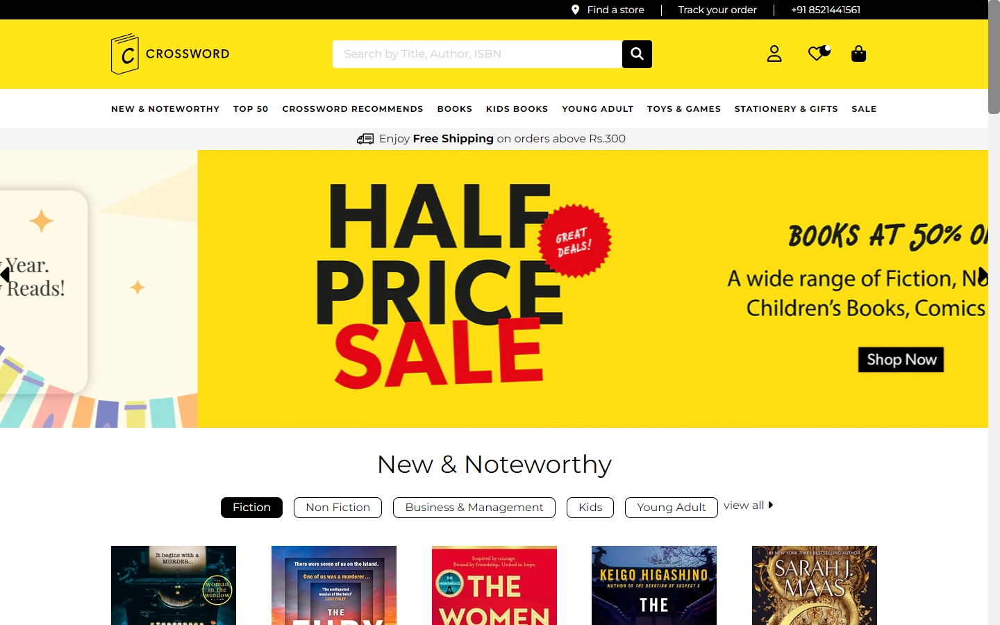
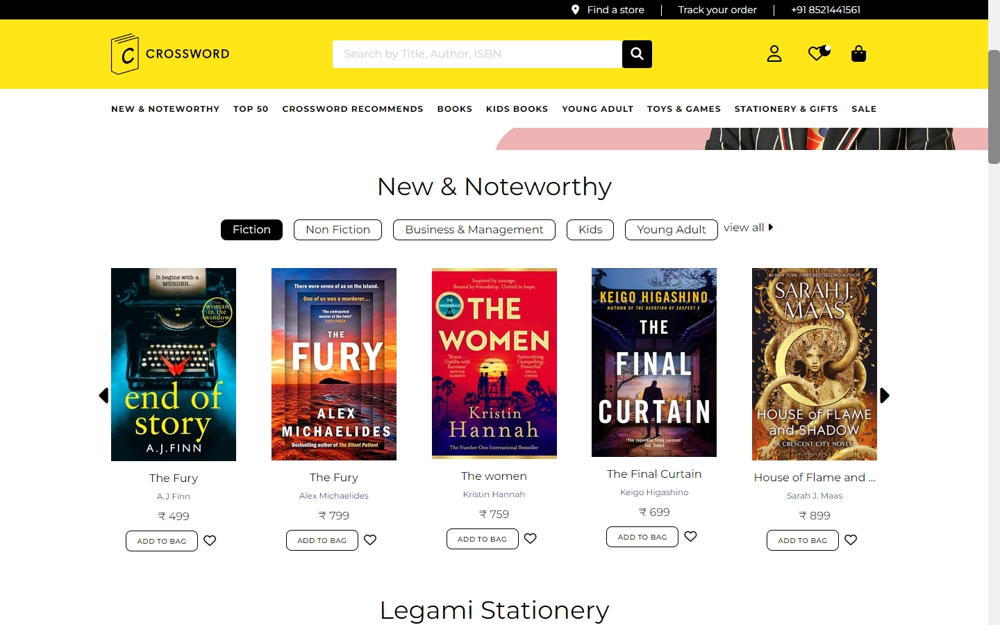
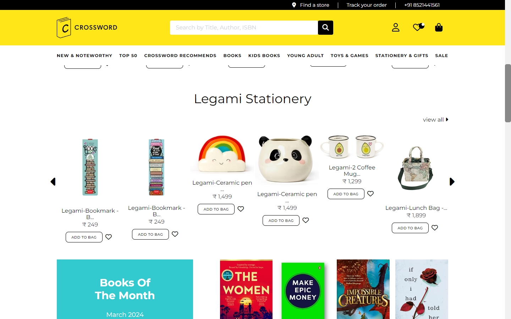
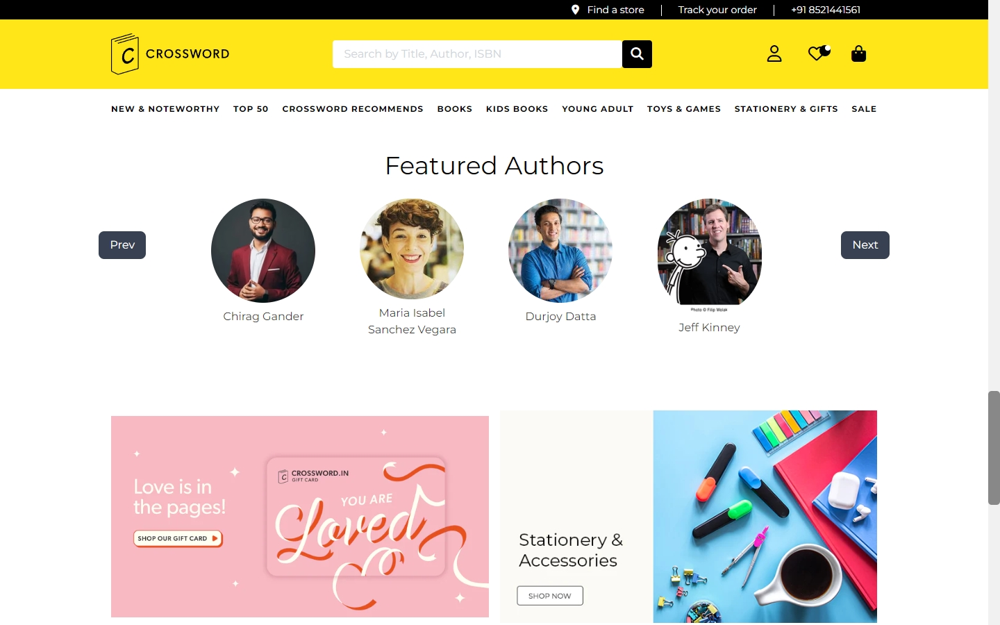
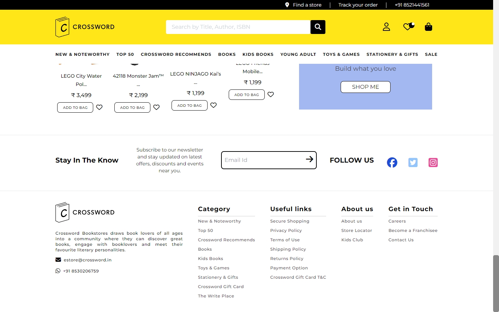
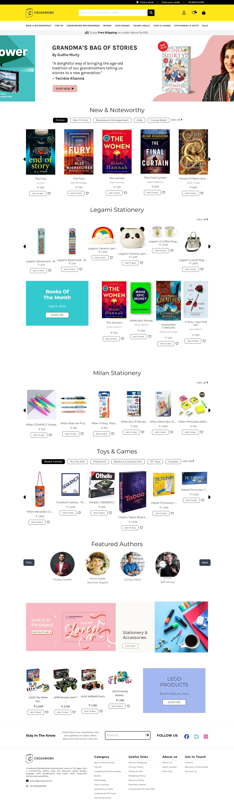
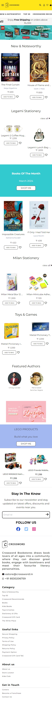

[HOSTED LINK 🔗](https://ibrahim1249.github.io/cross-word/Docs/)
---
[GitHub Repository](https://github.com/Ibrahim1249/cross-word)
---
 

# crossword  Website Clone

## Table of Contents

1. [Introduction](#introduction)
2. [Project Overview](#project-overview)
3. [Features](#features)
4. [Technologies Used](#technologies-used)
5. [Getting Started](#getting-started)
6. [Challenges Faced and Resolutions](#challenges-faced-and-resolutions)
7. [Website UI Explanation](#website-ui-explanation)
8. [Screenshots](#screenshots)
9. [Conclusion](#conclusion)

## Introduction

This project is a clone of the crossword  website, created as part of the [Geekster](https://www.geekster.in/) Full Stack Development course as a Major Project for me and my team members:
1. [Ibrahin Momin](https://github.com/Ibrahim1249) (Team Captain)
2. [Siddharth]()
3. [Elton]()
4. [Saiqua]()

The aim of this project is to replicate the user interface, functionality, and overall user experience of the original crossword  website.

 ## Project Overview

The Crossword website clone project is a comprehensive online bookstore that caters to book enthusiasts of all ages and interests. Our goal is to provide users with a seamless browsing and purchasing experience, akin to visiting a physical bookstore.

## Features

- **Extensive Book Collection**: Explore a vast collection of books spanning multiple genres, including fiction, non-fiction, academic, and children's literature.
- **User-Friendly Search**: Easily find books by title, author, genre, or keywords using our intuitive search feature.
- **Personalized Recommendations**: Receive personalized book recommendations based on your browsing history and preferences.

## Technologies Used

- HTML5
- CSS3
- Tailwind CSS
- Font Awesome

## Getting Started

To run this project locally, follow these steps:

1. Clone the repository: `git clone https://github.com/Ibrahim1249/cross-word.git`
2. Open the clone folder in your file explorer .
3. Open the docs folder and click on `index.html` in your browser

## Challenges Faced and Resolutions

1. First-Time Team Collaboration:
The initial challenge encountered was the coordination and collaboration within the team, especially for members who were working together for the first time. Establishing effective communication channels, defining roles and responsibilities, and fostering a collaborative environment were essential to ensure smooth progress and minimize misunderstandings.

2. GitHub Collaboration:
Adopting GitHub for collaborative development presented a learning curve, particularly for team members who were new to version control systems. Overcoming challenges related to branching strategies, resolving merge conflicts, and ensuring code consistency required proactive communication, adherence to best practices, and ongoing collaboration.

3. Browser Compatibility:
Achieving consistent rendering across different web browsers presented a challenge. Addressing compatibility issues and ensuring a uniform user experience across popular browsers such as Chrome, Firefox, Safari, and Edge required thorough testing and debugging.

4. Responsive Design Implementation:
Implementing a responsive design to ensure optimal viewing experiences across a wide range of devices and screen sizes presented a significant challenge. Coordinating the layout and styling adjustments to accommodate varying resolutions and aspect ratios while maintaining consistency and usability demanded meticulous planning, testing, and iteration. Responsive design frameworks such as Bootstrap or Tailwind CSS may have been leveraged to streamline the process and address responsiveness challenges effectively.

Navigating through these challenges required effective communication, proactive problem-solving, and a willingness to learn and adapt. By fostering a collaborative team culture, leveraging collaborative tools effectively, and prioritizing responsiveness in design and development, the team successfully addressed these challenges and made significant progress in developing Crossword.in Clone.

## Website UI Explanation

The website UI closely resembles the original Crossword website, with a clean and intuitive design. The homepage features a carousel of featured author, followed by categories for easy navigation. Books pages include detailed descriptions, images, and pricing information, along with an "Add to Cart" button for easy shopping and also while clicking on any of the book you will redirect to the original cart page for buying the book .

## Screenshots

**MacBook Pro**

 

  <b>Responsive in iPhone 12 Pro</b>

 

 

## Conclusion

Crossword clone is an online platform dedicated to book enthusiasts. With a user-friendly interface crafted using HTML, CSS, Tailwind CSS, and Font Awesome, we offer an immersive experience. Despite initial challenges, our team's dedication has resulted in a seamless website. We welcome users to explore our collections and contribute to our journey of growth. Together, we celebrate the love for books and foster a vibrant community of readers.

Thank you for joining us on this journey. We invite you to explore our Crossword website clone and experience the future of frontend development.

---